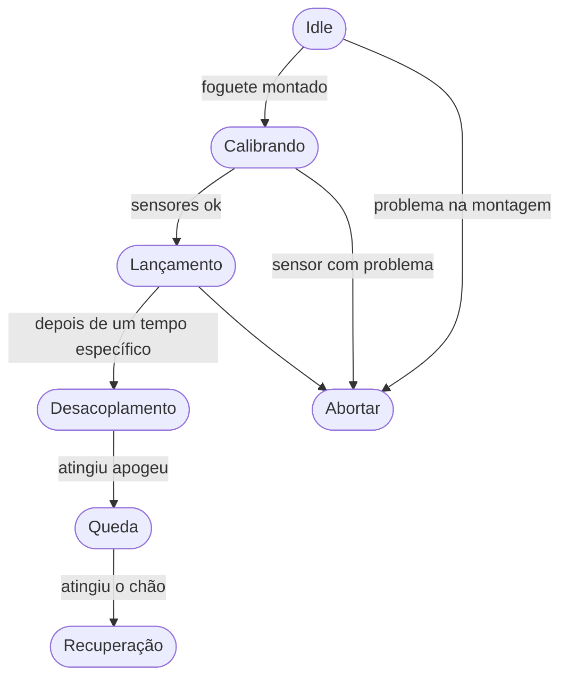

```mermaid

flowchart TD
    %%estados
    A([Idle])
    B([Calibrando])
    C([Lançamento])
    D([Desacoplamento])
    E([Queda])
    F([Recuperação])

    Z([Abortar])
    

    %%passos
    A-->|foguete montado|B
    B-->|sensores ok|C
    C-->|depois de um tempo específico|D
    D-->|atingiu apogeu|E
    E-->|atingiu o chão|F

    A-->|problema na montagem|Z
    B-->|sensor com problema|Z
    C-->Z
```
